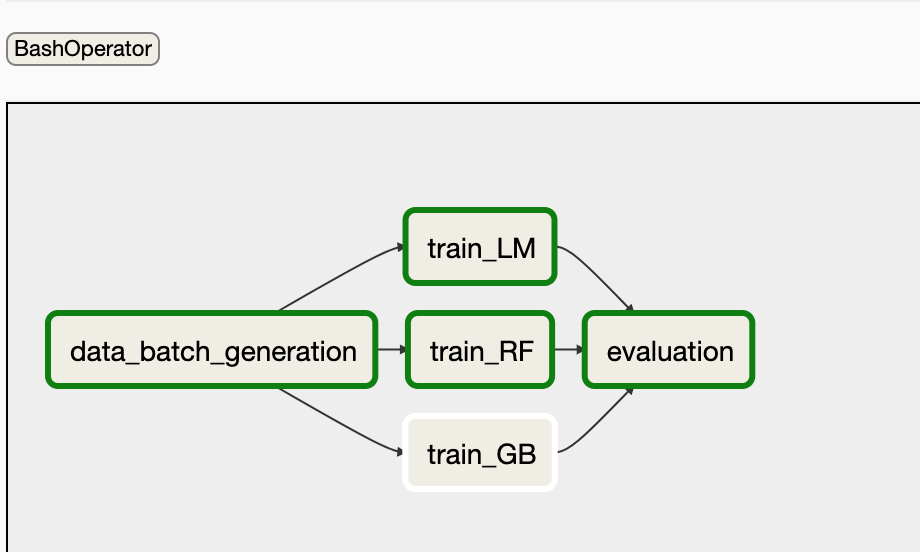

ML BENCHMARK

``` python -m venv venv
source venv/bin/activate|
pip install -r requirements.txt
pip install \
 apache-airflow==1.10.12 \
 --constraint "https://raw.githubusercontent.com/apache/airflow/constraints-1.10.12/constraints-3.7.txt"
```

AIRFLOW

```
export AIRFLOW_HOME=~/airflow
airflow initdb
# Run the webserver if you want to use it
airflow webserver -p 8080
# Run the scheduler
airflow scheduler 
```



INFLUXDB

```
docker pull influxdb
docker run -p 8086:8086       -v $PWD:/var/lib/influxdb       influxdb
```

Also
```
cp workflow_dag.py $AIRFLOW_HOME
export PYTHONPATH="$PWD"
export DATADIR="$PWD"
export RESULTDIR="$PWD"
```
